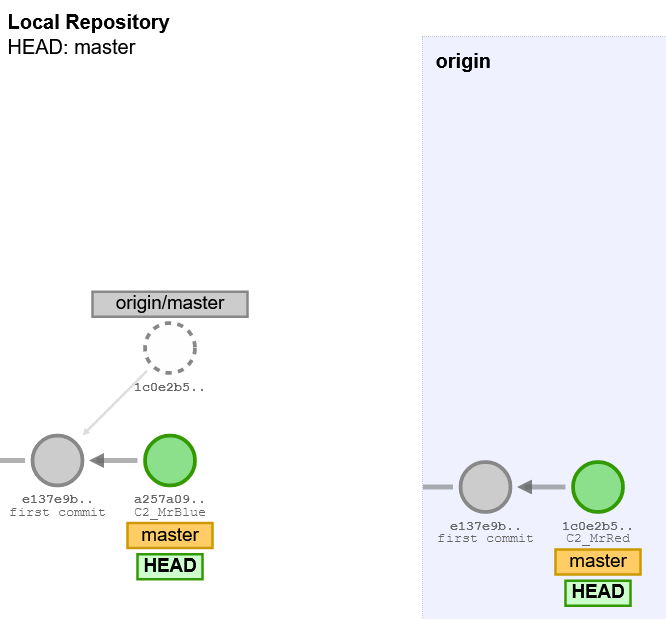
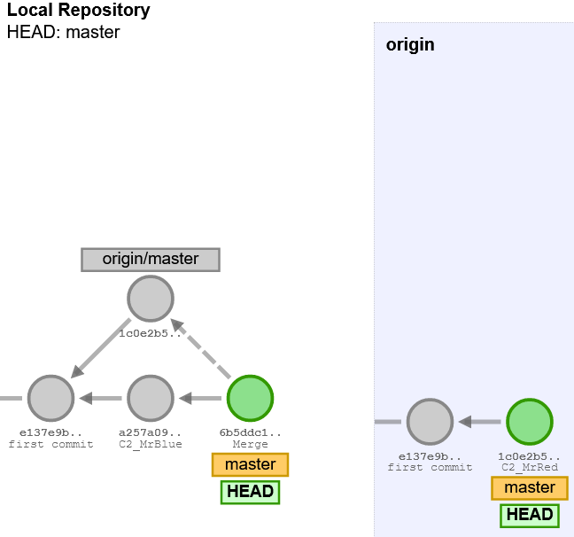
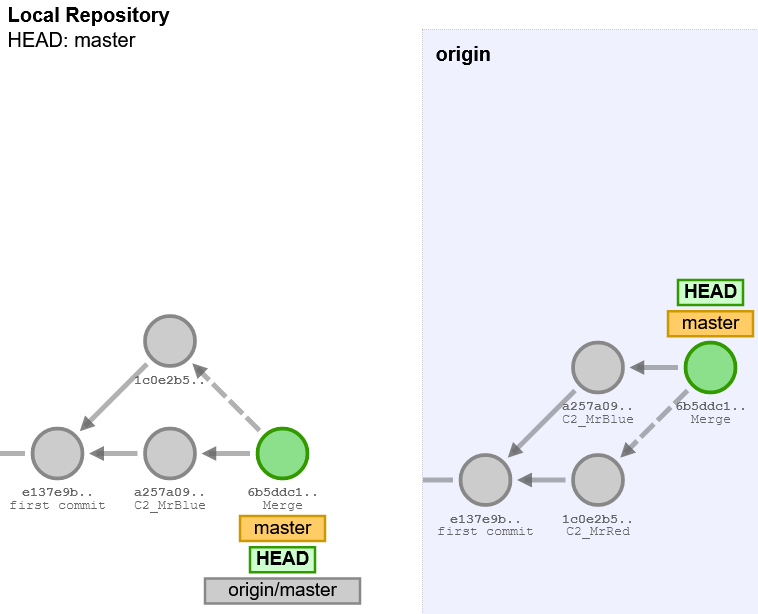

# GIT collision example
* code taken from [here](https://github.com/itelligence-cz/LBP-WA-Fiori/commit/d31039ee6e5da6c95e11c3817bed46b7a6e73bba)
```
that.setBusy("busy", true)
	that.doQuery({
		'op' : 'checkAndConfirmONStayDuration',
		'data' : JSON.stringify(aClosing)
}
```

<br/><br/>

1) fetch



---

2) merge



---

3) push



[link](http://git-school.github.io/visualizing-git/#free-remote)
